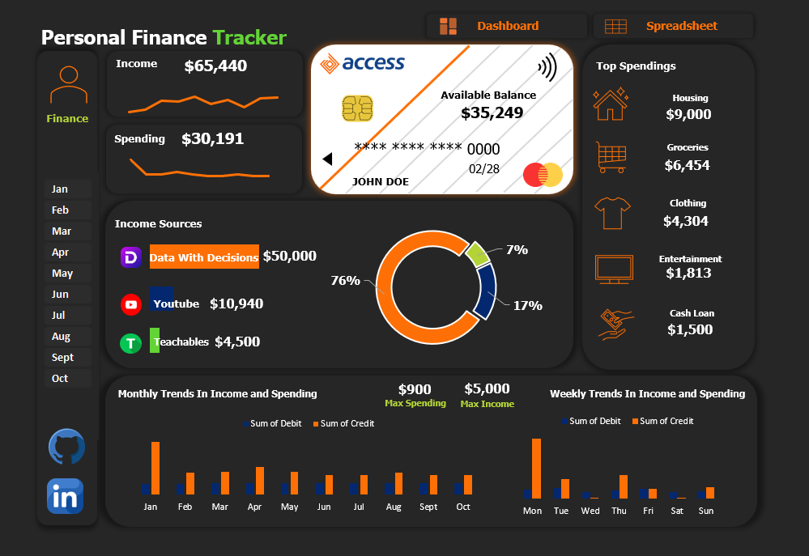
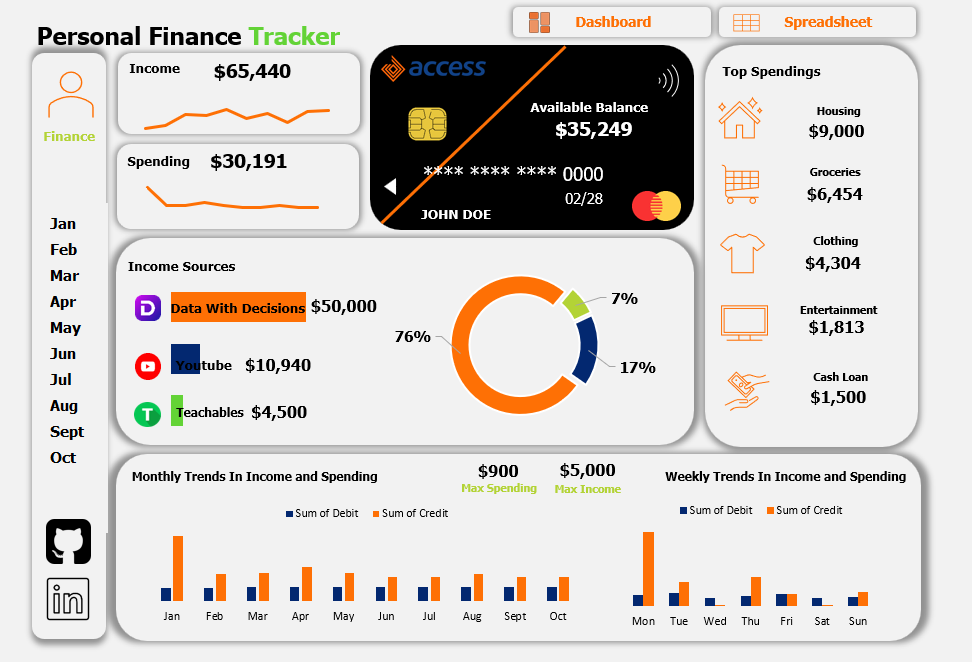

# PERSONAL-FINANCE-DASHBOARD
This contains a Personal Finance Dashboard that was inspired under the tutoring of a senior colleague. It was done using just microsoft excel. 

## Table of Content
1.0 - Introdcution

2.0 - Data Source

3.0 - Tools Used

4.0 - Data Transformation

5.0 - Data Visualization

6.0 - Insights Gotten

## 1.0 - Introdution 
This is a personal finance dahsboard that was created with the use of Microsoft Excel for cleaning and visualization with the aid of arranging a dashboard. It showed the versatility and the advanced uses of Microsoft Excel as a whole. A group of colleague participated in it and i decided to hop on it also. The originator behind this dashboard was Mr Freedom Oboh. 

## 2.0 - Data Source
The Data Source for this finance dashboard was provided by Freedom Oboh through a google drive. 

## 3.0 - Tools Used
3.1 - Microsoft Excel [Download Here](www.microsoft.com)

## 4.0 - Data Transformation. 
Using Microsoft Excel, i had to properly check for the data type of the dataset. Although the dataset was cleaned already to allow for ease of usage. I also used pivot tables for better analaysis and created the graphs necessary. I performed the appropriate number and currency formats to help aid analysis. 

## 5.0 - Data Visualization.
Uisng Micrsoft Excel, i used the Pivot Table fucntion to extract important summaries which was necessary for the analysis. I also customized the pivot table by adding slicer which would affect everything on the table for the sake of interactivity. 

